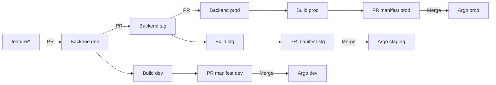

# GitOps seminar: GitHub Actions → GHCR → Argo CD

Hai repo: backend chứa code và CI; repo này chứa Kubernetes manifests và bootstrap local.
Luồng phát hành có **ba nhánh `dev`, `stg`, `prod` ở cả hai repo**. `main` giữ source/hạ tầng dùng chung.



Mỗi merge backend tự chạy test → build → scan → push GHCR → ký/attest → tạo PR image digest.
Merge PR manifest khiến Argo tự deploy **một môi trường tương ứng**. Build lại từng nhánh nên
ba digest có thể khác nhau. CI không có kubeconfig và không gọi deploy trực tiếp.

## Cấu hình ba môi trường

| Nhánh | Overlay / namespace | Replica | Env file |
| --- | --- | --- | --- |
| `dev` | `dev` | 1 | `apps/be-service/envs/dev/environment.env` |
| `stg` | `staging` | 2 | `apps/be-service/envs/staging/environment.env` |
| `prod` | `prod` | 3 | `apps/be-service/envs/prod/environment.env` |

Env file chỉ chứa cấu hình công khai: `APP_ENV`, `PORT`, `DEMO_MODE`, `DEMO_FAULT`.
Kustomize tạo ConfigMap có hash; thay đổi env làm pod rollout. Không đặt password/token vào env file.
`DB_PASSWORD` lấy từ Secret riêng trong từng namespace; ciphertext sinh tại máy bootstrap, không commit.
Backend không kết nối database thật trong seminar; Secret dùng để chứng minh cơ chế truyền cấu hình.

## Những file cần biết

```text
apps/be-service/base/       Deployment, Service, Ingress, image reference
apps/be-service/envs/       ConfigMap env, replica, hostname của từng môi trường
scripts/setup.sh           Dựng k3d và cài các controller
scripts/build.sh           Cấu hình GitHub Variables, trigger CI khi bootstrap/thử lại
scripts/render.sh          Chuẩn bị sealed secrets và Argo Applications
scripts/deploy.sh          Apply bootstrap; kiểm tra controller đã tạo Secret
scripts/check.sh           Kiểm chứng Git revision, image/runtime, replica và HTTP
scripts/demo.sh            Chạy/resume kịch bản release + failure + rollback nhiều vòng
scripts/demo-cycle.sh      Các bước và checkpoint của một vòng demo
scripts/demo-github.sh     Chờ CI/checks, tạo và merge PR đúng commit
scripts/local-common.sh    Hàm Bash dùng chung
scripts/local-dev.sh       Lệnh tắt up/status/down
scripts/tests/             Test hành vi bootstrap, manifests và release gates
.github/workflows/          CI validate manifests và verify artifact
```

Runtime dùng Bash và CLI. Python chỉ dùng để chạy tests, không dùng dựng cluster.
Hướng dẫn chọn case/chạy lặp: [docs/demo.md](docs/demo.md).
Happy case chạy tay, tự sửa code và merge từng PR: [docs/demo-happy.md](docs/demo-happy.md).

## Chạy demo tự động nhiều lần

Sau khi bootstrap và ba môi trường Healthy, chạy tại repo manifest:

```bash
bash scripts/demo.sh --preflight
bash scripts/demo.sh --scenario happy --count 1
```

Chọn case theo mục đích demo (mỗi lệnh tạo session riêng):

```bash
bash scripts/demo.sh --scenario failure --count 1  # Build lỗi, rollout lỗi, rollback
bash scripts/demo.sh --scenario all --count 1      # Happy trước, failure sau (mặc định)
```

Đổi count thành `10`, `100` hoặc `1000` để lặp case đã chọn. Với `all`, một vòng gồm **hai case**;
`--scenario all --count 10` chạy 10 cặp happy → failure. Script thực sự push source, tạo/merge PR
và dùng GitHub Actions; không chạy các lệnh ví dụ đồng thời.

| Case | Luồng | Kết quả |
| --- | --- | --- |
| `happy` | Feature → dev → stg → prod; tất cả build và deploy đạt | Cả ba môi trường chạy bản mới, Healthy |
| `failure` | Dev/stg đạt → prod build lỗi → retry đạt → rollout lỗi → PR revert | Dev/stg chạy bản mới; prod trở về baseline của case |
| `all` | Happy case hoàn tất → ghi baseline mới → failure case | Prod rollback về bản tốt vừa phát hành trong happy case |

Mỗi case tự tăng patch VERSION, dùng tên nhánh riêng và ghi baseline của từng môi trường.
Không cần xóa cluster, reset lịch sử hay chỉnh version thủ công giữa các lần chạy.

Script in SESSION và lưu checkpoint/log/evidence trong `.local/demos/SESSION/` (gitignored).
Nếu bị ngắt hoặc lỗi ngoài kịch bản, tiếp tục **session cũ**, không tạo một session mới:

```bash
bash scripts/demo.sh --resume SESSION
```

Thay `SESSION` bằng ID script đã in. Chỉ chạy một runner, dành riêng nhánh release trong lúc demo;
không merge PR hoặc trigger CI khác song song. Script merge sau khi tất cả checks đạt, không bypass
branch protection; nếu quy định yêu cầu người review thì review/merge trên GitHub rồi resume.
Checkout source của bạn giữ nguyên; các commit demo tạo trong clone riêng dưới thư mục session.

1000 vòng có thể chạy lâu và dùng nhiều quota Actions/GHCR. Script hỗ trợ số vòng đó nhưng dừng khi
GitHub, mạng, security gate hoặc cluster không đáp ứng kỳ vọng; không thể bảo đảm dịch vụ bên ngoài
luôn hoạt động. Bằng chứng kiểm thử và cách xử lý interruption xem [kịch bản demo](docs/demo.md#chạy-tự-động-và-tiếp-tục-khi-bị-ngắt).

## Dựng từ đầu

Cần Docker Desktop đang chạy; Bash, Git, `gh`, k3d, kubectl, kubeseal, jq,
Mike Farah yq v4, Kustomize và curl. Controller/tool versions pin trong `scripts/tool-versions.env`.
Windows dùng WSL2. Cần Internet để truy cập GitHub/GHCR và tải controllers.

Clone hai repo cạnh nhau, dùng URL của bên triển khai:

```bash
git clone <backend-repository-url> be-service
git clone <manifest-repository-url> gitops-manifests
cd gitops-manifests
cp .env.local.example .env.local
gh auth login
```

Chỉ copy env nếu chưa có file riêng. Các giá trị riêng nằm trong `.env.local` (gitignored):

| Biến | Mặc định |
| --- | --- |
| `BE_SOURCE_DIR` | `../be-service` |
| `CLUSTER_NAME` | `gitops-local` |
| `HTTP_PORT` / `HTTPS_PORT` | `8088` / `8443` |
| `STATE_DIR` | `.local` (hoặc thư mục con của nó) |
| `CONFIG_REPO_URL` | Suy ra từ Git remote repo manifest |
| `SOURCE_REPO` | Suy ra từ Git remote backend, dạng `OWNER/REPO` |

Không viết token vào URL Git hoặc commit `.env.local`, `.local/`.

### 1. Chuẩn bị nhánh và credential

Cả hai repo cần `dev`, `stg`, `prod` chứa source hiện tại. Khi clone một repo mới
chưa có các nhánh này, chạy ở **từng repo**:

```bash
git switch main
git pull --ff-only origin main
for branch in dev stg prod; do
  git branch "$branch" main
  git push origin "$branch"
done
```

Không chạy vòng lặp trên nếu nhánh đã tồn tại; cập nhật nhánh qua PR, không force push.
Đưa thay đổi hạ tầng/CI chung từ main vào các nhánh phát hành trước seminar.

Tạo secret `CONFIG_REPO_PAT` trong **cả hai repo**, qua GitHub Settings → Secrets and variables → Actions
hoặc `gh secret set CONFIG_REPO_PAT --repo OWNER/REPO`. CLI hỏi token qua stdin;
không đưa token vào command/source/chat. Credential backend cần quyền đọc/ghi manifest và tạo PR;
credential manifest cần đọc provenance/package tương ứng.

### 2. Dựng cluster và bootstrap

```bash
bash scripts/setup.sh
bash scripts/render.sh
bash scripts/deploy.sh
```

`setup.sh` tạo k3d, Ingress, Argo CD và Sealed Secrets. `render.sh` sinh ciphertext riêng cho cluster
và Applications theo dõi GitHub dev/stg/prod. `deploy.sh` apply và đợi Secret sẵn sàng.
Các Applications có thể chưa Healthy nếu nhánh còn image `bootstrap`.

### 3. Phát hành baseline cho từng môi trường

```bash
bash scripts/build.sh dev
bash scripts/build.sh stg
bash scripts/build.sh prod
```

Script thiết lập Variables và yêu cầu CI; không tự merge PR hoặc chờ rollout:

| Repo | Variable | Mục đích |
| --- | --- | --- |
| Backend | `ENABLE_GITOPS_RELEASE=true` | Bật publish và PR manifest |
| Backend | `CONFIG_REPO` | Repo manifest đích |
| Backend | `IMAGE_ARCH` | `arm64`/`amd64` theo Docker host |
| Manifest | `SOURCE_REPO` | Backend được phép cung cấp image |
| Manifest | `IMAGE` | GHCR image được phép |

Theo dõi Actions backend. Review và merge từng PR `release-be-service-dev`, `release-be-service-stg`,
`release-be-service-prod` **sau khi checks đạt**. CI manifest kiểm tra chữ ký/provenance theo đúng nhánh build.

```bash
bash scripts/check.sh
bash scripts/local-dev.sh status
```

`check.sh` lấy từng revision/digest từ nhánh tương ứng, kiểm tra Argo Synced/Healthy,
image runtime, replica 1/2/3 và `/version`. Mỗi môi trường có thể đang chạy version khác nhau.
Không chạy setup/build/render/deploy thủ công cho các release bình thường; dùng PR theo runbook.

### Quyền truy cập từ cluster

Với GitHub/GHCR công khai, cluster không cần credential pull. Với repo riêng, cấu hình repository
credential trong Argo; với package riêng, cấu hình `imagePullSecrets`. PAT của Actions không tự cấp quyền
cho cluster. Image phải hỗ trợ kiến trúc node; demo dùng một kiến trúc theo `IMAGE_ARCH`.

## Truy cập và mật khẩu Argo

| Dịch vụ | URL mặc định |
| --- | --- |
| Argo CD | http://localhost:8088/ |
| dev | http://dev.127.0.0.1.nip.io:8088/ |
| staging | http://staging.127.0.0.1.nip.io:8088/ |
| prod | http://prod.127.0.0.1.nip.io:8088/ |

Backend có `/healthz` và `/version`. DNS `nip.io` cần phân giải được; check dùng loopback + Host header.
Lấy password tài khoản Argo `admin` tại Terminal Bash:

```bash
source scripts/local-common.sh
load_config
kubectl --context "$CONTEXT" -n argocd get secret argocd-initial-admin-secret \
  -o jsonpath='{.data.password}' | base64 --decode
```

## Xóa cluster và dựng lại

```bash
bash scripts/local-dev.sh down
bash scripts/setup.sh
bash scripts/render.sh
bash scripts/deploy.sh
bash scripts/check.sh
```

Giữ `.env.local` và `.local` trên máy. Controller mới không giải mã ciphertext cũ thì render tự tạo lại.
Máy khác clone source và tạo env riêng, không copy private key hoặc state máy cũ.
Nếu image chưa hỗ trợ kiến trúc máy mới, cấu hình `IMAGE_ARCH` và phát hành lại bằng CI.

## Kiểm tra source

```bash
bash scripts/validate-manifests.sh
python3 -m unittest discover -s scripts/tests
```

Khi branch chứa image thực, đặt `IMAGE=ghcr.io/<owner>/<backend>` theo GitHub Variables trước khi validate.
Nếu CI lỗi, xem đúng job/log; nếu Argo lỗi, xem Application conditions/pod events.
Phạm vi seminar: release, cô lập môi trường, build failure, rollout failure và rollback qua Git.
Monitoring và database migration chưa nằm trong demo này.
