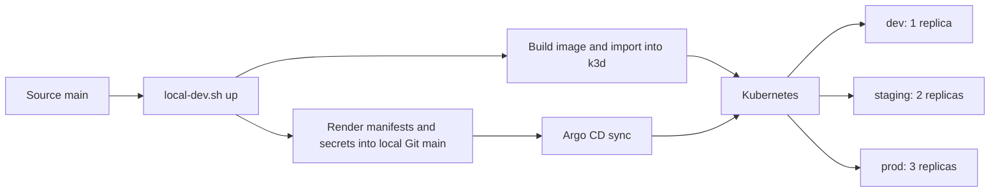

# GitOps local

Dựng backend, Kubernetes k3d, Argo CD và Sealed Secrets từ source trên `main`.
Ba overlay `dev`, `staging`, `prod` dùng chung image, với replica 1/2/3.
Flow local không cần đăng nhập GitHub, GHCR hoặc PAT.

## Yêu cầu

- Docker đang chạy, có BuildKit/buildx hỗ trợ `--provenance=false`.
- Bash, Python 3, Git, k3d, kubectl, kubeseal, Kustomize, Mike Farah yq v4.
- Internet để tải image, controller và package trong lần dựng đầu.
- Backend hỗ trợ kiến trúc Docker host `amd64` hoặc `arm64`.

Các phiên bản hạ tầng được pin trong `scripts/tool-versions.env` và
`scripts/local-git/Dockerfile`. Windows chạy các lệnh trong WSL2.

## Cấu trúc checkout

Clone hai repo với tên thư mục như sau; thay URL bằng repository cần sử dụng:

```bash
git clone <backend-repository-url> be-service
git clone <manifests-repository-url> gitops-manifests
cd be-service && git switch main
cd ../gitops-manifests && git switch main
```

```text
workspace/
├── be-service/
└── gitops-manifests/
    ├── apps/                 # Cấu hình chung và overlay môi trường
    ├── scripts/              # Launcher, hạ tầng và kiểm tra
    ├── .env.local.example    # Mẫu cấu hình dùng chung
    ├── .env.local            # Giá trị riêng, không commit
    └── .local/               # Dữ liệu sinh ra, không commit
```

## Cấu hình riêng

```bash
cp .env.local.example .env.local
```

Chỉnh `.env.local` khi đường dẫn, tên cluster hoặc port khác mặc định.
File chỉ chứa các cặp `KEY=value`, không chứa lệnh shell.
Biến môi trường của tiến trình được ưu tiên hơn file env.

| Biến | Mặc định | Chức năng |
| --- | --- | --- |
| `BE_SOURCE_DIR` | `../be-service` | Thư mục source backend |
| `CLUSTER_NAME` | `gitops-local` | Tên cluster riêng |
| `HTTP_PORT` | `8088` | Port HTTP trên loopback |
| `HTTPS_PORT` | `8443` | Port HTTPS trên loopback |
| `STATE_DIR` | `.local` | Dữ liệu runtime, chỉ nằm trong `.local/` |

Đường dẫn tương đối được tính từ repo manifest. Hai port phải khác nhau và
chưa bị dùng. Launcher từ chối cluster trùng tên nhưng không có metadata
hoặc có cấu hình khác. Khi đổi port/mount của cluster đã dựng, chạy `down`
bằng cấu hình cũ trước khi sửa env.

## Dựng và vận hành

```bash
bash scripts/local-dev.sh up
bash scripts/local-dev.sh status
bash scripts/local-dev.sh check
```

`up` dựng hạ tầng, build/import image, tạo sealed secret theo controller,
render manifest và publish Git snapshot nội bộ trên `main`. Argo CD theo dõi
snapshot này và triển khai từng overlay. Lệnh chỉ báo PASS sau khi kiểm tra
revision, trạng thái Argo, image runtime, replica, `/healthz` và `/version`.

Source chỉ chứa cấu hình chung; không chứa mật khẩu, ciphertext của cluster,
đường dẫn máy hoặc tài khoản. Sealed secret và Argo Applications được sinh
trong `.local/`. Mật khẩu được truyền qua stdin; private key controller
không được xuất ra máy. Manifest bootstrap phải qua launcher trước khi deploy.

Sau khi sửa source trên `main`, chạy lại `up`. Cả ba môi trường local nhận
cùng image mới. Ciphertext hợp lệ được tái sử dụng. Launcher không commit/push
source và không thao tác với các nhánh môi trường trên GitHub.



## Truy cập

Với env mặc định:

| Dịch vụ | URL |
| --- | --- |
| Argo CD | http://localhost:8088/ |
| dev | http://dev.127.0.0.1.nip.io:8088/ |
| staging | http://staging.127.0.0.1.nip.io:8088/ |
| prod | http://prod.127.0.0.1.nip.io:8088/ |

Backend có `/healthz` và `/version`. Đổi port trong URL nếu env khác mặc định.
Hostname `nip.io` cần DNS; CLI kiểm tra bằng loopback và Host header.

Argo CD dùng tài khoản `admin`. Lấy mật khẩu ban đầu trong terminal:

```bash
CONTEXT=$(python3 -c 'from scripts.local_dev import load_config; print("k3d-" + load_config()["CLUSTER_NAME"])')
kubectl --context "$CONTEXT" -n argocd get secret argocd-initial-admin-secret \
  -o jsonpath='{.data.password}' | base64 --decode
```

## Xóa và dựng lại

```bash
bash scripts/local-dev.sh down
bash scripts/local-dev.sh up
```

`down` xóa cluster được chọn trong env và giữ `.local/`. Khi controller mới
không giải mã được ciphertext cũ, launcher tạo lại secret. Khi chuyển máy,
clone source và tạo env mới; không mang `.env.local` hoặc `.local/` theo.

## Kiểm tra và xử lý lỗi

```bash
bash scripts/validate-manifests.sh
python3 -m unittest discover -s scripts/tests
```

Kiểm tra source cần thêm `jq`. Nếu dựng thất bại, kiểm tra `docker info`,
`local-dev.sh status` và Application conditions. Dùng context `k3d-<CLUSTER_NAME>`
để xem pod/event bằng kubectl. Không bỏ qua lỗi rollout hoặc timeout.

## CI hosted tùy chọn

CI manifest kiểm tra `main`. Backend CI mặc định test/build/scan; phát hành
GHCR, ký/provenance và PR image vào `main` chỉ bật khi cấu hình CI env:

| Repo | Variable/secret | Chức năng |
| --- | --- | --- |
| Backend | `ENABLE_GITOPS_RELEASE=true` | Bật phát hành và PR config |
| Backend | `CONFIG_REPO` | Repository manifest nhận PR |
| Backend | `IMAGE_ARCH` | `amd64` hoặc `arm64`, mặc định amd64 |
| Backend | secret `CONFIG_REPO_PAT` | Quyền tạo PR tại repo manifest |
| Manifest | `SOURCE_REPO` | Repository backend dùng để verify |
| Manifest | `IMAGE` | Image GHCR được phép |
| Manifest | secret `CONFIG_REPO_PAT` | Quyền đọc package/provenance khi verify |

Giá trị tài khoản/repository và token được đặt trong GitHub Variables/Secrets,
không viết vào source. Cluster hosted cần Argo source/credentials và secret
được cấu hình riêng theo cluster. Flow local không tự kết nối cluster tới GitHub.
