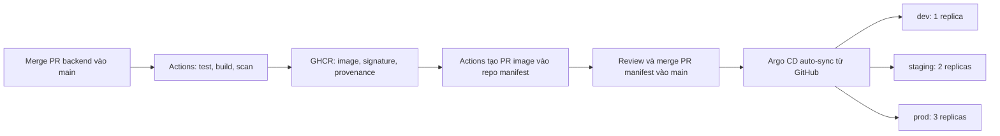

# GitOps: GitHub Actions → GHCR → Argo CD

Demo ba môi trường `dev`, `staging`, `prod` trên Kubernetes local.
Hai repo dùng `main`; ba overlay dùng chung image digest, replica tương ứng 1/2/3.



Merge backend tự khởi động CI. Merge PR manifest tự khởi động triển khai qua
Argo CD; không chạy Docker build/import hoặc render thủ công cho từng release.
Ba môi trường nhận cùng release; flow này không promote lần lượt từng môi trường.

## Yêu cầu

- Docker Desktop đang chạy; Bash, Git, k3d, kubectl, kubeseal, Kustomize,
  Mike Farah yq v4, jq, curl, GitHub CLI `gh`.
- Internet để tải controller/image và truy cập GitHub/GHCR.
- Go để kiểm tra backend trước PR. Python 3 chỉ dùng cho bộ test script/CI.
- Docker host hỗ trợ `arm64` hoặc `amd64`; CI cần build đúng kiến trúc cluster.
- Windows chạy trong WSL2. Phiên bản controller/tool được pin trong
  `scripts/tool-versions.env`.

## Checkout và cấu hình riêng

Clone hai repo cạnh nhau, thay URL bằng repo của bạn:

```bash
git clone <backend-repository-url> be-service
git clone <manifests-repository-url> gitops-manifests
cd gitops-manifests
cp .env.local.example .env.local
```

Chỉ copy env nếu chưa có file riêng. Không ghi tài khoản/token/đường dẫn máy
vào source hoặc commit `.env.local`, `.local/`.

| Biến env | Mặc định | Ý nghĩa |
| --- | --- | --- |
| `BE_SOURCE_DIR` | `../be-service` | Checkout backend, phục vụ demo và suy ra Git remote |
| `CLUSTER_NAME` | `gitops-local` | Cluster k3d |
| `HTTP_PORT` | `8088` | Port HTTP loopback |
| `HTTPS_PORT` | `8443` | Port HTTPS loopback |
| `STATE_DIR` | `.local` | Dữ liệu bootstrap, chỉ trong `.local/` |
| `CONFIG_REPO_URL` | Git remote `origin` của repo này | URL GitHub repo manifest |
| `SOURCE_REPO` | Git remote backend, hoặc cùng owner với tên `be-service` | Backend dạng `OWNER/REPO` |

File env chỉ chứa `KEY=value`, không thực thi shell. Biến môi trường tiến trình
được ưu tiên. `CONFIG_REPO_URL` không được chứa token. Repository/registry và
credential của mỗi bên được cấu hình qua env cùng GitHub Variables/Secrets.

## Cấu hình GitHub và GHCR

Đăng nhập GitHub CLI bằng `gh auth login`. Tạo `CONFIG_REPO_PAT` trong **cả hai
repo** qua GitHub Settings → Secrets and variables → Actions, hoặc `gh secret set`.
Không đưa token vào chat/source. Credential cần quyền đọc/ghi repo manifest,
tạo PR; phần verify image cần quyền đọc package/provenance tương ứng.

`build.sh` thiết lập các variable sau và yêu cầu CI trên backend `main`:

| Repo | Variable/secret | Chức năng |
| --- | --- | --- |
| Backend | `ENABLE_GITOPS_RELEASE=true` | Bật publish và PR manifest |
| Backend | `CONFIG_REPO` | Repo nhận PR image |
| Backend | `IMAGE_ARCH` | `arm64` hoặc `amd64` theo Docker host |
| Backend | secret `CONFIG_REPO_PAT` | Checkout/push/create PR manifest |
| Manifest | `SOURCE_REPO` | Backend được phép cung cấp image |
| Manifest | `IMAGE` | Image GHCR được phép |
| Manifest | secret `CONFIG_REPO_PAT` | Đọc package/provenance khi verify |

Workflow phải có trong `main` của hai repo. CI chạy quality/build/Trivy trước
khi publish, ký Cosign và attest provenance. PR image dùng digest bất biến;
CI manifest kiểm tra cấu hình, chữ ký và provenance trước khi merge.

Repo manifest và GHCR cần truy cập được từ cluster. Với repo/package công khai,
không cần credential pull. Với repo riêng, cấu hình repository credential trong
Argo CD; với package riêng, cấu hình `imagePullSecrets` cho workload. GitHub PAT
trong Actions không tự cấp quyền cho Argo hoặc Kubernetes.

## Dựng lần đầu

Các script dùng Bash; file YAML trong `scripts/templates/` chứa mẫu Argo
Application. Argo theo dõi **GitHub**, không dùng Git server nội bộ.

| Script | Vai trò |
| --- | --- |
| `setup.sh` | Tạo k3d và cài Ingress, Argo CD, Sealed Secrets |
| `render.sh` | Tạo sealed secret riêng cho cluster và ba Argo Applications |
| `deploy.sh` | Apply sealed secret và Applications; Argo tự quản lý backend |
| `build.sh` | Cấu hình CI và yêu cầu build trên GitHub, dùng để bootstrap/thử lại |
| `check.sh` | Đối chiếu GitHub main, digest/image runtime, replica và HTTP version/commit |
| `local-common.sh` | Hàm chung đọc env, gọi CLI và metadata |
| `local-dev.sh` | Lệnh tắt cho bootstrap, status, down |

Từ thư mục `gitops-manifests`, chạy:

```bash
bash scripts/setup.sh
bash scripts/render.sh
bash scripts/deploy.sh
bash scripts/build.sh
```

Lệnh `build.sh` yêu cầu CI, không chờ CI hoặc tự merge PR. Theo dõi Actions ở
repo backend. Khi CI hoàn tất, review PR `release-be-service-main` ở repo
manifest và merge sau khi checks pass. Argo tự triển khai cả ba môi trường.

```bash
bash scripts/check.sh
bash scripts/local-dev.sh status
```

`deploy.sh` chỉ xác nhận cấu hình bootstrap; `check.sh` mới xác nhận rollout.
Nếu source vẫn là image `bootstrap` trước release đầu, Application có thể chưa
Healthy; cần merge PR digest đầu tiên. Không bỏ qua lỗi rollout hoặc image pull.

Sealed secret được sinh trong `.local/bootstrap/secrets`, không đưa vào repo
manifest dùng chung. Bootstrap apply nó vào cluster để controller tạo Secret;
Deployment trong Git chỉ chứa `secretKeyRef`. Private key controller không được
xuất ra máy. Chạy lại render tái sử dụng ciphertext nếu controller còn giải mã được.

`bash scripts/local-dev.sh up` chỉ gọi `setup → render → deploy`, không yêu cầu
build hay merge PR. Sau khi đã có release trên GitHub, bootstrap và `check.sh`
là đủ để dựng máy khác, với CI/image phù hợp kiến trúc máy đó.

## Truy cập

Với port mặc định:

| Dịch vụ | URL |
| --- | --- |
| Argo CD | http://localhost:8088/ |
| dev | http://dev.127.0.0.1.nip.io:8088/ |
| staging | http://staging.127.0.0.1.nip.io:8088/ |
| prod | http://prod.127.0.0.1.nip.io:8088/ |

Backend có `/healthz` và `/version`. Đổi port theo env. Hostname `nip.io` cần DNS;
script check dùng loopback và Host header.

Lấy mật khẩu ban đầu của tài khoản Argo `admin` trong Terminal:

```bash
source scripts/local-common.sh
load_config
kubectl --context "$CONTEXT" -n argocd get secret argocd-initial-admin-secret \
  -o jsonpath='{.data.password}' | base64 --decode
```

## Kịch bản demo: hai PR và ba môi trường tự động

Chuẩn bị hạ tầng, CI Variables/Secrets và release đầu như phần dựng lần đầu.
Mở Actions backend, PR manifest, Argo CD và ba giao diện ứng dụng.
Dùng cùng Terminal Bash, bắt đầu ở thư mục `gitops-manifests`.

### 1. Ghi nhận bản đang chạy

```bash
bash scripts/check.sh
cd ../be-service
git switch main
git pull --ff-only origin main
git status --short
```

Backend phải sạch trước khi tạo nhánh. Chỉ ra ba Application đều
`Synced/Healthy`, replica 1/2/3, version/commit giống nhau.

### 2. Tạo PR backend

Chọn tên nhánh chưa tồn tại:

```bash
git switch -c feature/demo-ui
```

Trong `main.go`, hàm `handleRoot`, đổi tiêu đề `ServiceName` thành
`Backend API Service - Demo Release` (chọn chữ khác nếu đã dùng trước đó).
Tăng patch version trong `VERSION`, ví dụ `v1.3.0` → `v1.3.1`, phù hợp version
đang có trong repo. Không thay đổi secret hoặc cấu hình các môi trường.

```bash
gofmt -w main.go
bash scripts/check-quality.sh
git diff --check
git diff -- main.go VERSION
git add main.go VERSION
git commit -m "feat: update service title for automated release demo"
git push -u origin feature/demo-ui
gh pr create --base main --head feature/demo-ui \
  --title "Demo: automatic release to three environments" \
  --body "Change the title and version to demonstrate the GitHub Actions and Argo CD release flow."
gh pr checks feature/demo-ui --watch
```

Review diff và CI trước khi merge. Chưa merge thì ba môi trường vẫn chạy bản cũ.

### 3. Merge PR backend và quan sát CI

```bash
gh pr merge feature/demo-ui --merge
DEMO_MERGE_COMMIT=$(gh pr view feature/demo-ui --json mergeCommit --jq '.mergeCommit.oid')
git switch main
git pull --ff-only origin main
```

Mở Actions: merge tự chạy quality → build → scan → push GHCR → ký/attest →
tạo PR `release-be-service-main` trong repo manifest. Không chạy `build.sh`,
`render.sh` hoặc `deploy.sh` cho release này. Chờ đúng run của merge commit
hoàn tất; nếu CI thất bại thì chưa có release đủ điều kiện.

Lời dẫn: “Merge backend tự tạo artifact đã kiểm tra. CI đề xuất digest trong
repo manifest; cluster vẫn dùng trạng thái đã merge trước đó.”

### 4. Merge PR manifest và quan sát Argo auto-sync

```bash
cd ../gitops-manifests
source scripts/local-common.sh
load_config
gh pr list --repo "$CONFIG_REPO" --head release-be-service-main
gh pr view release-be-service-main --repo "$CONFIG_REPO" --web
gh pr checks release-be-service-main --repo "$CONFIG_REPO" --watch
```

Review PR: chỉ cập nhật image digest ở base Kustomize, có source commit và
link CI. Kiểm tra source commit đúng PR backend vừa merge và checks pass.

```bash
gh pr merge release-be-service-main --repo "$CONFIG_REPO" --merge
```

Giữ trang Argo mở: Application phát hiện GitHub main đổi, tự sync và rollout.
Refresh dev/staging/prod để thấy tiêu đề/version mới. Không chạy script deploy.
Có thể chỉ quan sát Argo chờ poll; `check.sh` yêu cầu refresh rồi đợi và kiểm chứng:

```bash
bash scripts/check.sh
```

Kết quả: ba Application `Synced/Healthy`, cùng digest và source commit mới,
replica giữ 1/2/3. Revision Argo là commit repo manifest; `/version.git_commit`
là commit backend, nên hai SHA khác nhau là đúng.

Lời dẫn: “Merge PR manifest cập nhật trạng thái mong muốn trong Git.
Argo tự đồng bộ ba môi trường; máy này không build hoặc import image thủ công.”

### 5. Rollback cũng qua hai PR

Giữ `DEMO_MERGE_COMMIT` của bước 3; nếu đổi Terminal, lấy đúng SHA merge backend.
Tạo nhánh rollback từ main, revert merge rồi tăng patch version mới trong
`VERSION` để rollback có version riêng và dễ truy vết:

```bash
cd ../be-service
git switch main
git pull --ff-only origin main
git switch -c rollback/demo-ui
git show --stat "$DEMO_MERGE_COMMIT"
git revert -m 1 --no-edit "$DEMO_MERGE_COMMIT"
# Sửa VERSION thành patch version mới trước khi chạy tiếp
bash scripts/check-quality.sh
git add VERSION
git commit -m "chore: version the rollback release"
git push -u origin rollback/demo-ui
gh pr create --base main --head rollback/demo-ui \
  --title "Demo: rollback service title" --body "Restore the previous title through a new release."
gh pr checks rollback/demo-ui --watch
gh pr merge rollback/demo-ui --merge
```

CI tự phát hành image rollback và tạo PR manifest. Review/merge PR đó như
bước 4; Argo tự đưa giao diện về tiêu đề cũ. Không sửa Deployment trực tiếp.

## Xóa và dựng lại

```bash
bash scripts/local-dev.sh down
bash scripts/setup.sh
bash scripts/render.sh
bash scripts/deploy.sh
bash scripts/check.sh
```

`down` xóa cluster chọn trong env, giữ runtime/env trên máy. Controller mới
không giải mã ciphertext cũ thì render tạo lại. Máy mới chỉ clone source và tạo
env riêng, không mang `.env.local`, `.local` hoặc private key theo.
Nếu image trên GitHub chưa phù hợp kiến trúc máy mới, cấu hình lại `IMAGE_ARCH`
và phát hành qua CI trước khi check.

## Kiểm tra source và xử lý lỗi

```bash
bash scripts/validate-manifests.sh
python3 -m unittest discover -s scripts/tests
```

Khi source đang có digest thực, đặt biến `IMAGE` theo GitHub Variables trước
khi validate. Nếu chưa có PR manifest, xem backend Actions và secret/variable;
ếu Argo lỗi repo, xem repository credential; nếu pod `ImagePullBackOff`, kiểm
tra GHCR quyền pull và kiến trúc. Xem Application conditions/pod events bằng
context `k3d-<CLUSTER_NAME>`. Không dùng Git nội bộ hoặc build local để thay thế
một release CI đang lỗi.
