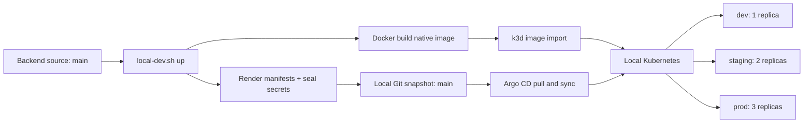

# GitOps local dev

Clone `be-service` và `gitops-manifests` cạnh nhau, dùng nhánh `main` ở cả hai repo.
Lệnh dưới đây build backend từ source local, dựng cluster k3d, cài Argo CD và
Sealed Secrets, rồi triển khai ba overlay `dev`, `staging`, `prod` với 1/2/3 replica.
Không cần tài khoản GitHub, registry riêng hoặc PAT để chạy local.

```bash
cp .env.local.example .env.local
bash scripts/local-dev.sh up
bash scripts/local-dev.sh check
```

Cần Docker đang chạy, Bash, Python 3, Git, k3d, kubectl, kubeseal,
Kustomize và **Mike Farah yq v4**. Máy phải có Internet khi tải image và controller.
Image backend build cho `amd64` hoặc `arm64` theo Docker host.

Argo CD: <http://localhost:8088>. Backend:
<http://dev.127.0.0.1.nip.io:8088/version>,
<http://staging.127.0.0.1.nip.io:8088/version>,
<http://prod.127.0.0.1.nip.io:8088/version>.
Đọc [hướng dẫn dựng từng bước](scripts/rebuild-step-by-step.md) để lấy mật khẩu,
đổi port, chạy lại sau khi sửa source và xử lý lỗi.

Argo CD đọc Git snapshot nội bộ trên `main`, trong `.local/`, qua Git server
chỉ đọc trong cluster. Các manifest đã render và sealed secret được tạo riêng
cho máy/cluster; `.local/` và `.env.local` không được đưa vào Git. `up` không
commit hoặc push repo source. Chạy lại `up` để build và cập nhật snapshot.
Ba môi trường local cùng nhận image mới; tên `prod` ở đây là môi trường demo local.



[Runbook](scripts/demo-runbook.md) có các lệnh vận hành và cấu hình GitHub/GHCR
nếu cần demo release có ký, provenance và promotion qua nhánh môi trường.
Flow GitHub này cần cấu hình riêng; CI mặc định không phát hành hoặc cập nhật repo khác.
